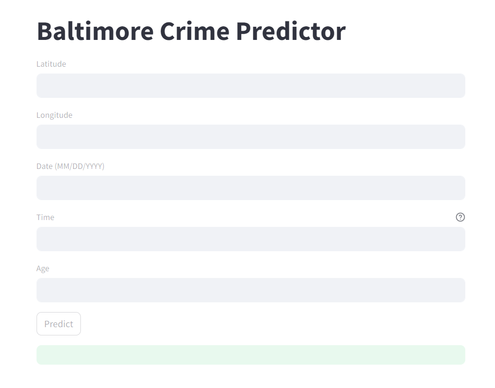
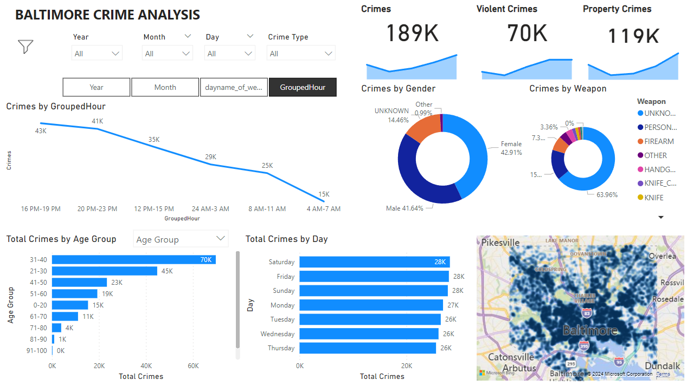

# Baltimore Crime Analysis and Prediction

### Steps

* In the conda environment, install the packages: Pandas, NumPy, matplotlib, seaborn, sklearn, ipywidgets,wordcloud, streamlit
* Once the packages are installed, run the files in order:
    1. Data_Preprocessing.ipynb
    2. Crime_Data_Analysis.ipynb
    3. Prediction.ipynb
* Webpage: For the webpage using streamlit, run the command: streamlit run app.py
    
* Power BI report:The Power BI dashboards helps in exploring the analysis results.
    

     